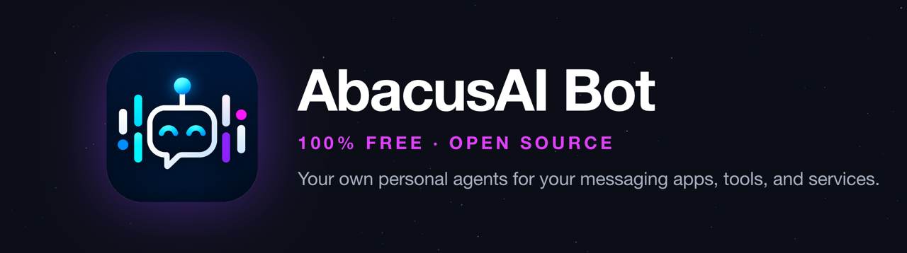
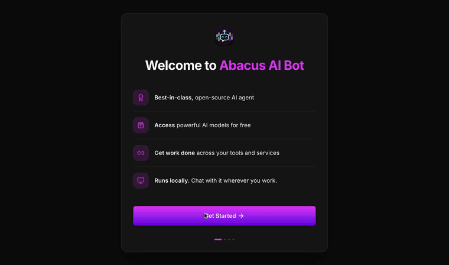

# AbacusAI Bot: 100% free, open-source personal agents for your messaging apps, tools and services

<p align="center">
  <picture>
    <source media="(prefers-color-scheme: light)" srcset="docs/media/banner-light.png">
    
  </picture>
</p>

<p align="center">
  <a href="https://bot.abacus.ai/">Website</a> ·
  <a href="https://github.com/abacusai/abacusai-bot/releases/latest">Download</a> ·
  <a href="docs/README.md">Docs</a> ·
  <a href="CHANGELOG.md">Changelog</a> ·
  <a href="SUPPORT.md">Support</a>
</p>

<p align="center">
  <a href="https://github.com/abacusai/abacusai-bot/releases/latest"></a>
  <a href="LICENSE"></a>
  <a href="https://github.com/abacusai/abacusai-bot/actions/workflows/ci.yml"></a>
</p>

Create a bot for a job you want to hand off. Give it a name, instructions, and a model. Each bot keeps its own chat and memory and uses the tools you enable. Message it from the desktop, WhatsApp, Telegram, or Discord. It can work in Gmail, Google Drive, Slack, GitHub, Notion, and other connected services, then check in or run again on a schedule.

Coding is one of the jobs a bot can do. AbacusAI Bot is built for personal assistance, research, communication, recurring work, and tasks that cross several apps.

> [!IMPORTANT]
> Bot chats and routines run with full tool permissions. They can edit files, run commands, send messages, and act through connected accounts without the approval mode used by supervised sessions. Remote messaging has separate sender and tool controls. Review [permissions](docs/permissions.md) and the [security model](SECURITY.md) before creating recurring or remote work.

## Start free

The desktop app is free and MIT-licensed. You do not need an existing paid model subscription. A free Abacus.AI account starts with 2,000 credits, includes a selection of free models, and enables the built-in connector flow. OpenRouter and Google AI Studio add other free options.

RouteLLM - Open selects from eligible free models and moves to another one when a model or provider is unavailable. You can also bring paid provider keys, subscriptions, or a local OpenAI-compatible model.

Provider catalogs, quotas, and free-tier limits can change. The Models page shows what the installed app can use. Read [Models](docs/models.md) for routing and key behavior.

## Product tour

<details open>
<summary>See onboarding</summary>
<br>
<table>
  <tr>
    <td></td>
  </tr>
  <tr>
    <td align="center">Sign in, connect the apps you use, choose a model, and meet your first bot.</td>
  </tr>
</table>

<!-- Add screenshot pairs as a two-cell image row followed by a two-cell caption row. Store media in docs/media/. -->
</details>

## Bots

A bot is a standing personal agent, not a temporary chat. It has its own mission, persona, model, app-managed folder, chat, and memory. It uses the capabilities and services you enable, can wake on a scheduled check-in, and keeps separate conversations with people it is allowed to answer.

Start from a blank bot or use a template such as Chief of Staff, WhatsApp Agent, Email Drafting, Morning Brief, Research Scout, Meeting Prep, or Follow-Up Tracker. Everything in a template remains editable.

## Messaging

Reach a bot from the apps already on your phone:

| App | How it works |
| --- | --- |
| WhatsApp | Link AbacusAI Bot as a device, then talk to it through your "Message yourself" chat. It can also read and send in allowed conversations. |
| Telegram | Sign in to your account, then link the shared Abacus AI bot. Direct messages reach your agent, and the connected account can read and send messages. |
| Discord | Sign in to your account, then link the shared Abacus AI bot. Direct messages reach your agent, and the connected account can work in allowed chats. |

Connecting an account does not make the bot answer everyone. Incoming messages are recorded but do not start work by default. You choose whether a bot may respond, approve each sender, select its workspace, and decide whether risky remote tool calls run immediately or wait in the desktop app. Unattended remote tools are on by default once you enable inbound responses. Pause any sender or turn all messaging off without deleting the setup.

See [Bots, routines, and messaging](docs/messaging.md) for setup and safety boundaries.

## Connectors and routines

AbacusAI Bot exposes 100+ connectors and tools. Built-in Abacus.AI connectors include Gmail, Google Drive, Google Calendar, Slack, Outlook, OneDrive, Jira, Confluence, Dropbox, X, and other work services. The app also supports MCP servers, skills, local tools, browsers, files, and devices.

A connector gives bots and sessions tools for an account. The bot can ask you to connect a service when it needs one. Disconnect the service to remove that account access.

Routines run a bot hourly, daily, on weekdays, weekly, once, on demand, or from a webhook. Every run has its own record and output. Local routines require the desktop app to be running. You can inspect, run, pause, edit, or delete them from the Routines page.

## What bots can do

| Area | Examples |
| --- | --- |
| Personal assistance | Prepare a daily brief, track follow-ups, remember preferences, and plan the day. |
| Communication | Read conversations, draft replies, send approved messages, and answer approved people. |
| Research | Search the web and connected sources, monitor a topic, and produce cited reports. |
| Connected work | Read mail, manage calendars and files, update issues, and post to work services. |
| Creation | Produce documents, slides, spreadsheets, designs, images, audio, video, and web artifacts. |
| Computer tasks | Use a browser, edit workspace files, run commands, and operate supported mobile devices. |
| Coding | Inspect a repository, implement changes, review diffs, run tests, and manage Git work. |

One-off supervised sessions remain available for work that does not need a persistent bot.

## Permissions and data

Default, Auto-Accept, Plan, Auto, and Full access modes control supervised sessions. Bot chats and routine runs use the default mode and do not show the mode picker. They run as your operating-system user and can reach files and connected accounts without an approval prompt. Routine instructions include their own folder and every workspace registered in the app.

The default mode is Full access: no approval prompts and no sandbox. The Profile page can change it to Auto, which is the same inside a kernel sandbox: shell commands cannot write outside the workspace, read credential stores such as SSH keys, or reach hosts you have not allowed, and a card asks when one tries. Auto is offered on macOS, Linux with bubblewrap, and Windows 11 24H2 or newer.

Remote messaging also uses the default mode when "Run remote turns unattended" is on. That setting is on by default, although inbound responses remain off until you enable them. Turning it off makes risky actions wait for approval in the desktop app.

Read [Permissions and execution](docs/permissions.md) before enabling a bot, routine, or remote sender.

Bot settings, memory, conversations, and app settings are stored locally. Requests and attachments go to the model provider you choose. Connectors send data to their configured services. With a saved Abacus.AI API key, the app automatically sends transcripts, logs, and diagnostics to Abacus.AI over HTTPS for product improvement and troubleshooting. See [Privacy and local storage](docs/privacy.md) for what is collected and how log redaction works.

## Install

Download the latest macOS, Windows, or Linux build from [GitHub Releases](https://github.com/abacusai/abacusai-bot/releases/latest). Apple Silicon, Intel, x64, and ARM64 packages are available where the platform supports them.

The current onboarding signs you in or creates a free account, offers messaging and work connectors, helps you choose a model, shows the main controls, and creates a Chief of Staff bot on a fresh install. The template contains a weekday check-in, so the bot can create that routine when its first chat starts. A routine created by a bot runs once immediately. See [Getting started](docs/getting-started.md).

## Repository scope

This repository contains the AbacusAI Bot desktop application. It does not publish a CLI, SDK, hosted agent, or remote execution service. Internal storage formats and application protocols may change between releases. Only the latest release is supported.

To build the app, use Node.js 22 and pnpm:

```bash
corepack enable
pnpm install
pnpm dev
```

The full environment and packaging commands are in [Build from source](docs/getting-started.md#build-from-source).

## Community

- [Support](SUPPORT.md) covers setup, diagnostics, and issue routing.
- [Contributing](CONTRIBUTING.md) explains which community submissions are accepted.
- [Security](SECURITY.md) defines the trust model and private reporting process.
- [Code of Conduct](CODE_OF_CONDUCT.md) applies to project spaces.

## Acknowledgements

AbacusAI Bot builds on [pi](https://github.com/badlogic/pi-mono), [codingagent-lite](https://github.com/mariozechner/codingagent-lite), and [scrcpy](https://github.com/Genymobile/scrcpy).

## License

[MIT](LICENSE)
